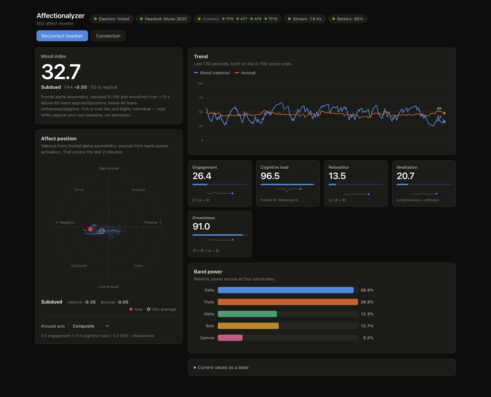

# Affectionalyzer

A live EEG affect monitor. Reads brain-state metrics from a local
[NeuroSkill](https://github.com/NeuroSkill-com/skill) daemon over its WebSocket
API and plots them as a valence × arousal circumplex. A second headset on a
second machine can be plotted alongside the first and tested for
[interpersonal synchrony](#hyperscanning-a-second-person).

Tested against skill-daemon 0.1.0 (protocol version 1) with a Muse 2.



*Live capture — a real Muse 2 session streaming at ~8 Hz.*

## Quick start

1. Run the NeuroSkill app and connect your headset.
2. `npm install`
3. `npm run dev`

The dev server finds the running daemon by itself — it reads the token file and
resolves the port from the daemon PID, falling back to probing the usual ports.
The startup log says which port it found. If it finds nothing, open **Connection**
in the app and enter a port and token manually.

## What it shows

**Valence** is the daemon's `mood` index: frontal alpha asymmetry
(`ln(α_AF8) − ln(α_AF7)`) rescaled to 0–100, where 50 is neutral. FAA is the most
studied EEG correlate of approach/withdrawal motivation, but it is trait-like and
highly individual — read shifts against your own baseline, not absolute values.

**Arousal** has no single canonical index, so it is a choice rather than a fact.
The selector under the circumplex switches between:

| Source | Definition |
|---|---|
| Composite (default) | `0.5·engagement + 0.3·cognitive load + 0.2·(100 − drowsiness)` |
| Engagement | `β / (α + θ)` — the biocybernetic activation index |
| Cognitive load | frontal θ / temporal α |
| Wakefulness | the daemon's `consciousness_wakefulness` score |

The composite weights are a judgement call, not something the daemon or the
literature prescribes. The active formula is always printed under the selector.

Everything user-facing reads a time-smoothed mood (τ ≈ 1.5 s) so the hero figure,
the trend line and the circumplex point can never disagree. The table view
exposes the unsmoothed per-frame value alongside it.

## Focus mode and panels

- **Focus** (or the `f` key) puts the supporting panels away and widens what is
  left to fill the page.
- **Panels** toggles all six panels individually — mood index, affect position,
  trend, brain-state scores, band power and table view — with **Show all** and
  **Hide all**.

Focus does one thing: it suppresses the four supporting panels. The mood index
and affect position keep following their own checkboxes, so focus never
re-shows something you chose to hide, and you can still toggle them from the
menu while focused. **Leaving focus is the reset** — it brings every panel back.

Emptying a column drops the layout to a single centred column. Hiding everything
leaves a restore button, so the view is never a dead end. Both focus and the
per-panel choices persist across reloads.

## Hyperscanning: a second person

Two headsets on two machines, plotted together and tested for coupling.

### Reaching the second daemon

The daemon **binds strictly to `127.0.0.1`**. It refuses connections on its own
LAN address, so there is no host you can point this app at — a port scan of the
network finds nothing because nothing is ever listening off loopback. Forward it
onto a local port instead:

```bash
ssh -N -L 18454:127.0.0.1:18444 user@partner-host
```

The remote daemon is now `127.0.0.1:18454`, which is why `{port, token}` is
enough to address both subjects and no host field is needed. It also keeps the
full-access token off the wire.

Each daemon has its own token, and the partner's lives on the partner's machine.
Pass it at dev-server start, or enter it under **Connection**:

```bash
AFFECT_PARTNER_TOKEN=… AFFECT_PARTNER_PORT=18454 npm run dev
```

The startup log reports both sources; if the tunnel is down it says so rather
than leaving you to decode a WebSocket error in the browser. Pointing both
sources at one daemon is refused outright — it would compare a brain with itself
and report perfect synchrony.

### What it shows

The circumplex gains a second point and trail, joined by a line whose length is
the pair's affective distance. The two subjects are told apart by **shape** —
circle for you, diamond for your partner — because both marks already spend
their colour on valence. The trend chart overlays your partner's mood as a
dashed line, and the **Synchrony** panel reports windowed correlation of valence
and of arousal.

### Reading the synchrony numbers

Every correlation is shown against a **surrogate floor**: the same computation
with the two signals deliberately misaligned in time. This is the whole point of
the panel. Smoothed EEG indices correlate with each other by construction — over
40 simulated independent pairs, raw |r| ran to a median of 0.12 and a maximum of
0.30 — so an unqualified 0.3 looks like rapport when it is really autocorrelation.
Only the part of a bar past the marked threshold is evidence of anything.

Three things follow from the signal rather than from choice:

- **Correlation runs on local arrival time, not daemon timestamps.** The two
  daemons keep independent wall clocks; a second of NTP skew would fabricate or
  destroy coupling. Both streams arrive at one process, so arrival time is one
  clock. The trend chart switches to the same basis when paired.
- **Each epoch is detrended first.** These indices drift, and two drifting
  signals correlate on their ramps alone. Measured live on two Muse 2 headsets,
  the floor on raw levels sat at **0.68** — a full minute unable to separate
  coupling from drift.
- **The epoch is 2 minutes because 1 was not enough.** FAA is already smoothed on
  roughly a 5 s constant, so a 60 s window holds only ~12 effectively independent
  samples, and the floor measured 0.52 — about the critical |r| for that many.
  Doubling the window doubles the samples and drops the floor by roughly √2.

A lead/lag readout appears only when the lagged peak clears its *own*, higher
floor: sweeping ~33 offsets is a maximisation that will always return some best
answer, and an ungated readout would name a leader from noise.

None of this makes one 2-minute window a finding. It is a live monitor, not an
experiment: no replication, no pre-registration, one dyad.

## Notes on the daemon

- `EegBands` events arrive at **~8 Hz** on a Muse 2, not the ~4 Hz the API docs
  state. Rendering is decoupled from the event rate via `requestAnimationFrame`.
- Raw `EegSample` / `PpgSample` / `ImuSample` events are ignored — this app plots
  derived metrics only.
- BLE drops are common. The client reconnects with capped exponential backoff,
  and **Reconnect headset** calls `POST /v1/control/retry-connect` (admin scope).
- Signal-quality levels are not a documented closed set (`good` and `fair` are
  both observed); unknown levels degrade to a neutral indicator.

## Security

The daemon token is a **full-access credential**. The Vite plugin injects it into
the dev bundle only (`apply: 'serve'`); production builds get `null` and rely on
the in-app Connection panel. If you deploy this anywhere, create a scoped token
with `POST /v1/auth/tokens` (`"acl": "stream"` is enough for the live dashboard)
rather than reusing the default one.

## Available commands

- `npm install`
- `npm run dev`
- `npm run build` — type-checks with `tsc`, then bundles
- `npm run preview`
- `npm test` — the synchrony estimator's error rates, via esbuild + node (no
  test framework, no extra dependencies)

## Project structure

- `index.html` — app shell
- `src/main.ts` — wiring, render loop, hero figure, table view
- `src/neuroskill/` — daemon client, event types, credential resolution
- `src/affect/model.ts` — valence/arousal derivation, smoothing, history buffer
- `src/affect/sync.ts` — interpersonal synchrony, surrogate testing (`sync.test.ts`)
- `src/ui/` — circumplex, trend chart, synchrony panel, stat tiles, band bars,
  status bar, settings
- `src/styles.css` — palette and layout
- `vite.config.ts` — dev-only daemon discovery plugin
